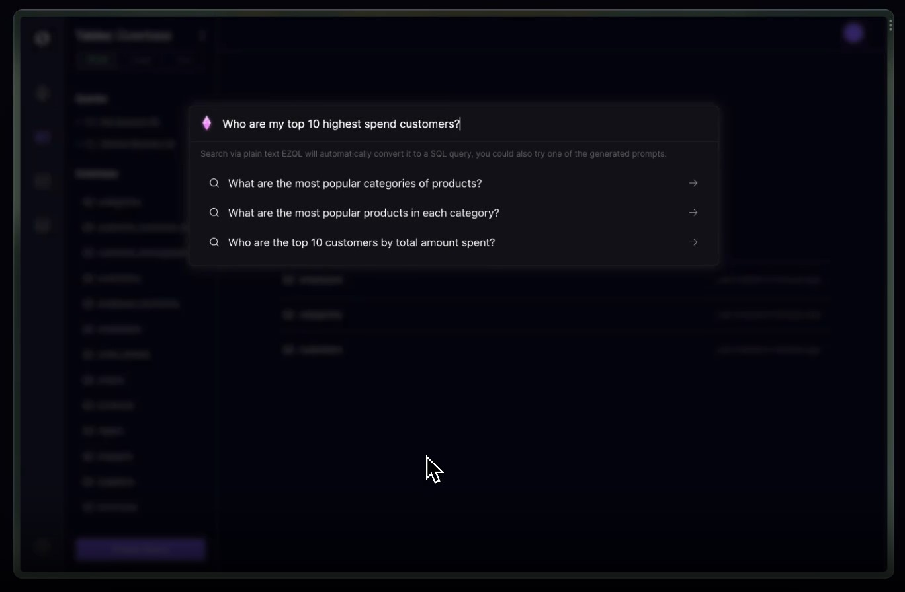

# 
DataLens

 Diagnose with Data, Treat with Design 
        

## 🫡 Features    
- SQL? No Thanks 😼 : GPT-3 powered interface allows you to query data using natural language, making data analysis easy and accessible for everyone.
- Transform data into insights 🤓 : Extended support for data visualization for more granular data analysis. Don't just collect data, create insights!
- Create, don't duplicate 🤝: Create snippets for frequent queries and share it across your teams.
- Streamline Operations 🚀: Improve operational observability via real-time alerts. Say goodbye to missed opportunities and delayed decision making.
- BYODB / Bring Your Own DB 🍾: Connects with multiple datasources, PostgreSQL, MySQL, Redshift and even CSV files. DataLens takes care of the technicalities so you can focus on what really matters ;)
        
<!-- ROADMAP -->
## Roadmap

- [ ] Spark
     - [ ] Snippets Management
     - [ ] Team Feat
     - [ ] Configure ElasticSearch
     - [ ] Configure Payments
- [ ] Markov
     - [ ] Datasource Handling
     - [ ] CSV / Excel Handling
     - [ ] Autogenerate Schema
     - [ ] Data Sampling
- [ ] Query
    - [ ] Query Validator
    - [ ] Query Sandbox
   - [ ] Query Autosuggest
- [ ] Express
     - [ ] Export DataFrame
     - [ ] Charting Endpoint
- [ ] Catalina
     - [ ] Scheduled Alerts Endpoint
     - [ ] Webhook Handling
- [ ] Vanguard
     - [ ] Configure Lambda
     - [ ] Configure API Gateway
     - [ ] Configure Cognito
     - [ ] Configure Step Function
     - [ ] Configure SNS
     - [ ] Configure Transactional Mailing
- [ ] Fresco
     - [ ] Configure RDS, Parameter Store, ElastiCache
     - [ ] Configure ECS, Elastic Load Balancing
     - [ ] Configure Transactional Mailing
     - [ ] Migrate asynchronous workload to serverless compute

See the [open issues](https://github.com/github_username/repo_name/issues) for a full list of proposed features (and known issues).

## Contributing    

Any contributions you make are **greatly appreciated**. Before contributing, please read the [code of conduct](CODE_OF_CONDUCT.md) & [contributing guidelines](CONTRIBUTING.md).
     
If you have a suggestion that would make this better, please fork the repo and create a pull request. You can also simply open an issue with the tag "enhancement".
Don't forget to give the project a star! Thanks again!

1. Fork the Project
2. Create your Feature Branch `git checkout -b feature/AmazingFeature`
3. Commit your Changes `git commit -m 'Add some AmazingFeature'`
4. Push to the Branch `git push origin feature/AmazingFeature`
5. Open a Pull Request

## License
Distributed under the MIT License. See [LICENSE](LICENSE) for more information.
        
    